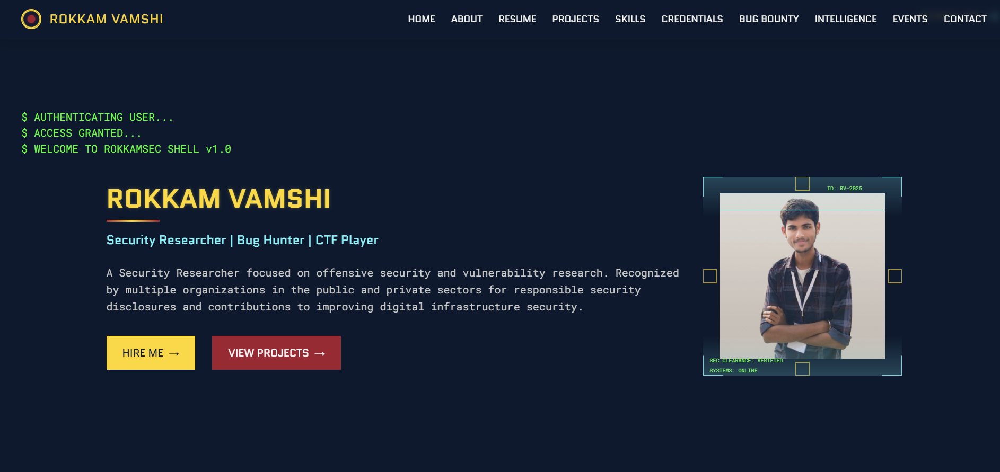

# Rokkam Vamshi - Cybersecurity Portfolio


This is my little corner of the internet — an interactive portfolio I put together with a security-inspired look (kind of like a futuristic command center ✨). Here, I share the projects I've worked on, the skills I'm building, and bits of my journey in cybersecurity. I've also added an interactive blog system because I like writing down what I learn and turning it into stories others can follow.

## 🔒 Overview

Hi, I'm Aang (@iamaangx028). I'm learning and exploring cybersecurity, mostly around offensive security, penetration testing, and vulnerability research. This site isn't meant to be flashy — it's just a space where I can track my growth and share what I'm figuring out along the way.

One part I'm really excited about is the Security Intelligence Hub. It's my blog, but with a twist — it uses a graph-style navigation so you can literally follow the path of my learning journey and dig into technical insights as I discover them.



## 🛠️ Technical Implementation

### Project Structure

```
rokkamvamshi.github.io/
├── index.html                 # Main portfolio site
├── README.md                  # Project documentation
├── assets/                    # Static assets
├── Blog/                      # Interactive cyber blog
│   ├── cyber-blog.html        # Blog interface
│   ├── cyber-blog-graph.js    # Graph navigation logic
│   ├── cyber-blog.css         # Blog styling
│   ├── cyber-blog-graph.css   # Graph-specific styles
│   └── blog-config.json       # Blog content configuration
├── css/                       # Stylesheets
│   ├── all.css               # Core styles and variables
│   ├── main.css              # Main layout styles
│   ├── jarvis.css            # J.A.R.V.I.S. assistant styles
│   ├── resume.css            # Resume section styles
│   ├── orgs.css              # Organizations section styles
│   └── [other component styles]
├── js/                        # JavaScript functionality
│   ├── main.js               # Core functionality
│   ├── jarvis.js             # Virtual assistant logic
│   ├── arsenel.js            # Skills section animations
│   ├── cert.js               # Certification cards
│   ├── recognition-section.js # Bug bounty section
│   ├── intelligence-section.js # Blog integration
│   ├── resume.js             # Resume interactivity
│   ├── ui-interactions.js    # General UI animations
│   ├── ack.js                # Organizations marquee
│   └── cyber-blog-integration.js # Blog integration
├── images/                    # Portfolio images and assets

```

## 🔧 Setup and Installation

1. Clone the repository:

   ```bash
   git clone https://github.com/rokkamvamshi/rokkamvamshi.github.io.git
   ```

2. Navigate to the project directory:

   ```bash
   cd rokkamvamshi.github.io
   ```

3. Open `index.html` in your browser to view the main portfolio, or navigate to `Blog/cyber-blog.html` for the interactive blog.

## 👤 About the Developer

[iamaangx028](https://x.com/iamaangx028), I am a security researcher with a passion for sharing knowledge. This portfolio stands as both a professional showcase and an educational resource for the cybersecurity community.

## 📞 Contact Information

- **Email**: [vamsirokkam9@gmail.com](mailto:iamaangx028@gmail.com)
---

**Made with ❤️ by Rokkam Vamshi** | *Securing the digital frontier, one line of code at a time*
