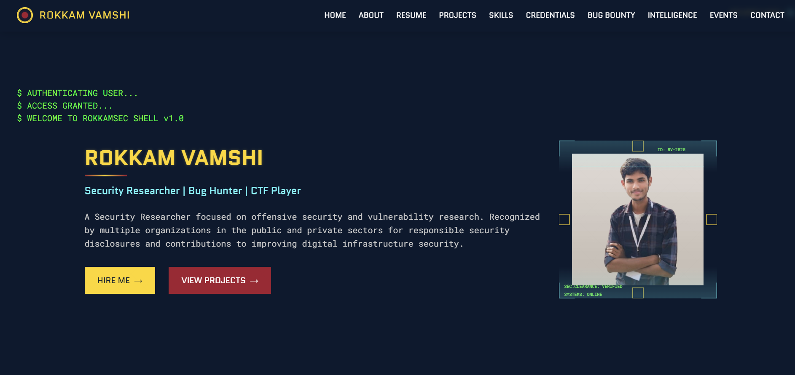

# iamaangx028 - Personal Portfolio 


**🌐 Live:** [iamaangx.me](https://iamaangx.me)

This is my little corner of the internet — an interactive portfolio I put together with a security-inspired look (kind of like a futuristic command center ✨). Here, I share the projects I've worked on, the skills I'm building, and bits of my journey in cybersecurity. I've also added an interactive blog system because I like writing down what I learn and turning it into stories others can follow.

## 🔒 Overview

Hi, I'm Aang (@iamaangx028). I'm learning and exploring cybersecurity, mostly around offensive security, penetration testing, and vulnerability research. This site isn't meant to be flashy — it's just a space where I can track my growth and share what I'm figuring out along the way.

One part I'm really excited about is the Security Intelligence Hub. It's my blog, but with a twist — it uses a graph-style navigation so you can literally follow the path of my learning journey and dig into technical insights as I discover them.



## 🛠️ Technical Implementation

### Project Structure

```
iamaangx028.github.io/
├── index.html                 # Main portfolio site (all sections inline)
├── README.md                  # Project documentation
├── assets/                    # Resume files (PDF)
├── Blog/                      # Interactive "Mission Control" blog
│   ├── index.html            # Blog interface
│   ├── js/app.js             # MissionControl app (fetch + render + filter)
│   ├── css/style.css         # Blog styling
│   └── blog-config.json      # Blog content (posts keyed weekN)
├── css/                       # Stylesheets
│   ├── design-system.css     # Shared design tokens (palette, fonts)
│   ├── all.css               # Core styles and variables
│   ├── main.css              # Main layout styles
│   ├── jarvis-advanced.css   # J.A.R.V.I.S. assistant styles
│   ├── resume.css            # Resume section styles
│   └── orgs.css              # Organizations section styles
├── js/                        # JavaScript (plain scripts, no modules)
│   ├── main.js               # Core functionality + contact form
│   ├── arsenel.js            # Skills section animations
│   ├── cert.js               # Certification cards
│   ├── recognition-section.js # Bug bounty / LOA section
│   ├── intelligence-section.js # Blog cards filter/search
│   ├── resume.js             # Resume interactivity
│   ├── ui-interactions.js    # General UI animations
│   ├── ack.js                # Organizations marquee
│   └── cyber-blog-integration.js # Blog transition + Ctrl/Cmd+B
├── images/                    # Portfolio images and assets

```

> Note: `js/jarvis.js` exists but is **not loaded** (commented out); the live assistant is the inline `AdvancedJarvis` class in `index.html`.

## 🔧 Setup and Installation

1. Clone the repository:

   ```bash
   git clone [https://github.com/iamaangx028/iamaangx028.github.io](https://github.com/iamaangx028/iamaangx028.github.io)
   ```

2. Navigate to the project directory:

   ```bash
   cd iamaangx028.github.io
   ```

3. Serve the folder over HTTP (the blog uses `fetch()` and won't work from `file://`):

   ```bash
   python3 -m http.server 8000   # then open http://localhost:8000
   ```

   Open `/` for the main portfolio, or `/Blog/` for the interactive blog.

## 👤 About the Developer

[iamaangx028](https://x.com/iamaangx028), I am a security researcher with a passion for sharing knowledge. This portfolio stands as both a professional showcase and an educational resource for the cybersecurity community.

## 📞 Contact Information

- **Email**: [iamaangx028@gmail.com](mailto:iamaangx028@gmail.com)
---

**Made with ❤️ by iamaangx028** | *Securing the digital frontier, one line of code at a time*
