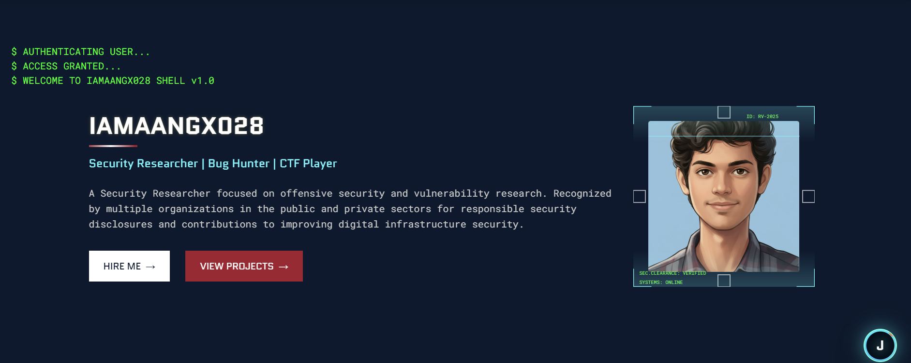

# Rokkam Vamshi - Cybersecurity Portfolio


A modern, interactive cybersecurity portfolio website with a futuristic security interface inspired by advanced command center aesthetics. This portfolio showcases cybersecurity expertise, projects, and professional achievements with engaging UI elements and an integrated interactive blog system.

## 🔒 Overview

This portfolio website serves as a professional showcase for Rokkam Vamshi, a cybersecurity specialist focusing on offensive security, penetration testing, and vulnerability research. The site features a sophisticated design with interactive elements that create an immersive "security interface" experience while maintaining professional credibility.

The portfolio includes both a comprehensive main site and an integrated **Security Intelligence Hub** - an interactive cyber blog with graph-based navigation for exploring cybersecurity learning journeys and technical insights.



## ⚡ Features

### Main Portfolio Features

- **Terminal-Style Authentication Header**: Simulated authentication sequence on page load
- **Interactive Security HUD**: Heads-Up Display elements throughout UI components
- **Responsive Mobile Design**: Fully responsive design that adapts to all screen sizes
- **Animated Skills Visualization**: Dynamic progress indicators for skills and tools
- **Project Cards**: Interactive project showcases with security classification themes
- **Credentials Display**: Certificate showcase with verification functionality
- **Bug Bounty Showcase**: Interactive display of security findings and acknowledgments
- **Intelligence Reports Section**: Blog posts displayed as security intelligence briefings
- **Events Timeline**: Professional journey and achievements timeline
- **Contact Form**: Styled as a secure communication channel
- **J.A.R.V.I.S.-inspired Assistant**: Interactive helper for site navigation

### Security Intelligence Hub (Cyber Blog)

- **Interactive Graph Navigation**: Node-based exploration of cybersecurity topics
- **10-Week Learning Journey**: Comprehensive cybersecurity fundamentals curriculum
- **Dynamic Content Loading**: Real-time statistics and content updates
- **Cyberpunk UI Theme**: Immersive security interface with futuristic aesthetics
- **Responsive Modal System**: Clean information display with navigation guides
- **Cross-Navigation**: Seamless integration between main portfolio and blog
- **Keyboard Shortcuts**: Enhanced accessibility with Ctrl+B shortcut support

## 🛠️ Technical Implementation

### Project Structure

```
rokkamvamshi.github.io/
├── index.html                 # Main portfolio site
├── README.md                  # Project documentation
├── assets/                    # Static assets
├── Blog/                      # Interactive cyber blog
│   ├── cyber-blog.html        # Blog interface
│   ├── cyber-blog-graph.js    # Graph navigation logic
│   ├── cyber-blog.css         # Blog styling
│   ├── cyber-blog-graph.css   # Graph-specific styles
│   └── blog-config.json       # Blog content configuration
├── css/                       # Stylesheets
│   ├── all.css               # Core styles and variables
│   ├── main.css              # Main layout styles
│   ├── jarvis.css            # J.A.R.V.I.S. assistant styles
│   ├── resume.css            # Resume section styles
│   ├── orgs.css              # Organizations section styles
│   └── [other component styles]
├── js/                        # JavaScript functionality
│   ├── main.js               # Core functionality
│   ├── jarvis.js             # Virtual assistant logic
│   ├── arsenel.js            # Skills section animations
│   ├── cert.js               # Certification cards
│   ├── recognition-section.js # Bug bounty section
│   ├── intelligence-section.js # Blog integration
│   ├── resume.js             # Resume interactivity
│   ├── ui-interactions.js    # General UI animations
│   ├── ack.js                # Organizations marquee
│   └── cyber-blog-integration.js # Blog integration
├── images/                    # Portfolio images and assets
└── mario/                     # Interactive game demo
```

### Design Elements

The design follows a cybersecurity-focused aesthetic with:

- **Color Scheme**: Deep navy blue (#0A192F), muted crimson (#A51C30), gold highlights (#FFD700), terminal green (#4AF626), cyan accents (#64f9ff)
- **Typography**: Technical-looking fonts (Quantico for headings, Roboto Mono for body text)
- **Visual Components**: Security mesh backgrounds, terminal windows, HUD frames, scan lines, glassmorphism effects
- **Animations**: Terminal typing effects, scan animations, loading sequences, hover transitions
- **Interactive Elements**: Node-based navigation, modal systems, progress indicators, animated counters

### Blog Content Structure

The Security Intelligence Hub features a comprehensive 10-week cybersecurity learning curriculum:

1. **Week 1**: OSI Model, TCP/IP stack, Subnetting, DNS
2. **Week 2**: Networking fundamentals, PAN/LAN/VLAN/WLAN, hubs/switches/routers, SSL/TLS
3. **Week 3**: Browsers and the Web, DOM/CSSOM, rendering pipeline
4. **Week 4**: Browser security, cookies, SRI, MIME checking, clickjacking defense
5. **Week 5**: HTTP evolution, TLS/SSL, content negotiation, caching
6. **Week 6**: System design, proxies, APIs, CDNs, WebSockets, microservices
7. **Week 7**: Web app architecture, client-server models, MVC, SOA, SPAs
8. **Week 8**: HTTP headers deep dive, CORS, HSTS, security headers
9. **Week 9**: Front-end/back-end overview, CGI, app servers, frameworks
10. **Week 10**: Front-end concepts, Vanilla JS, JSX, AJAX, components, SPA routing

## 🔧 Setup and Installation

1. Clone the repository:

   ```bash
   git clone https://github.com/rokkamvamshi/rokkamvamshi.github.io.git
   ```

2. Navigate to the project directory:

   ```bash
   cd rokkamvamshi.github.io
   ```

3. Open `index.html` in your browser to view the main portfolio, or navigate to `Blog/cyber-blog.html` for the interactive blog.

## 📱 Responsiveness & Compatibility

The site is fully responsive with:

- **Desktop/laptop optimal viewing** (1200px+ width)
- **Tablet adaptations** with adjusted layouts and touch-friendly controls
- **Mobile "field terminal" experience** with collapsible sections and optimized navigation
- **Cross-browser compatibility** tested on modern browsers
- **Progressive enhancement** approach for older browsers

## 🚀 Performance Optimizations

- Optimized image assets with modern formats
- Efficient CSS with CSS custom properties and modular architecture
- Progressive enhancement approach
- Lazy loading for images and content
- Reduced motion option for accessibility
- Minimal JavaScript bundle with tree-shaking
- Preloaded critical resources for faster loading

## 🔍 SEO & Accessibility

### SEO Features

- Semantic HTML structure with proper heading hierarchy
- Descriptive meta tags and Open Graph integration
- Twitter Card support for social media sharing
- Canonical URLs and structured data
- Alt text for all images
- Sitemap-friendly navigation structure

### Accessibility Features

- WCAG 2.1 AA compliance
- Semantic HTML with ARIA attributes
- Keyboard navigation support throughout
- Screen reader compatibility
- Sufficient color contrast ratios
- Focus indicators and skip-to-content links
- Reduced motion preferences respected

## 🔄 Recent Updates (October 2025)

- **Enhanced Security Intelligence Hub**: Complete redesign with interactive graph navigation
- **Improved Modal System**: Better user experience with accessible navigation guides
- **Updated Content**: 10-week comprehensive cybersecurity learning curriculum
- **Cross-Navigation**: Seamless integration between portfolio and blog sections
- **Performance Improvements**: Optimized loading and interaction responsiveness
- **Accessibility Enhancements**: Better keyboard navigation and screen reader support

## 📜 License

This project is licensed under the MIT License - see the LICENSE file for details.

## 👤 About the Developer

[Rokkam Vamshi](https://linkedin.com/in/rokkam-vamshi) is a cybersecurity specialist with expertise in penetration testing, bug bounty hunting, and vulnerability research. With a passion for sharing knowledge, he maintains this portfolio as both a professional showcase and an educational resource for the cybersecurity community.

## 📞 Contact Information

- **Email**: [vamsirokkam9@gmail.com](mailto:vamsirokkam9@gmail.com)
- **LinkedIn**: [rokkam-vamshi](https://linkedin.com/in/rokkam-vamshi)
- **GitHub**: [rokkamvamshi](https://github.com/rokkamvamshi)
- **Medium**: [@iamaangx028](https://medium.com/@iamaangx028)
- **HackerOne**: [@rokkam_vamshi_](https://hackerone.com/rokkam_vamshi_)
- **Twitter**: [@rokkam_vamshi](https://twitter.com/rokkam_vamshi)

## 🤝 Contributing

While this is a personal portfolio project, suggestions for improvements are welcome. Please feel free to:

- Report bugs or issues
- Suggest new features or content
- Provide feedback on the user experience
- Share ideas for the Security Intelligence Hub

## 🙏 Acknowledgments

- Built with modern web technologies and a focus on user experience
- Inspired by cybersecurity command centers and futuristic interfaces
- Special thanks to the cybersecurity community for continuous learning opportunities

---

**Made with ❤️ by Rokkam Vamshi** | *Securing the digital frontier, one line of code at a time*
